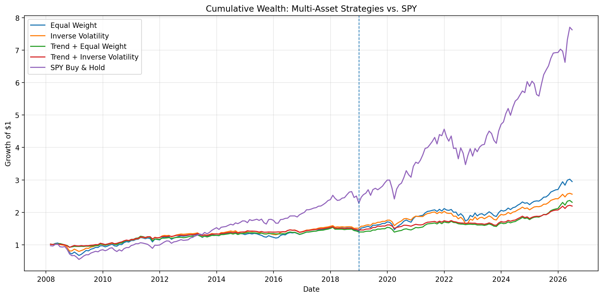
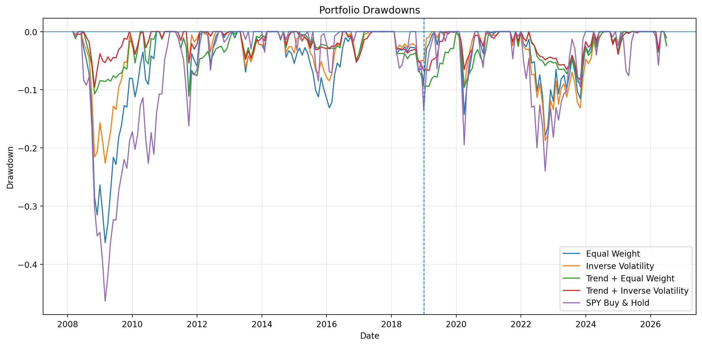
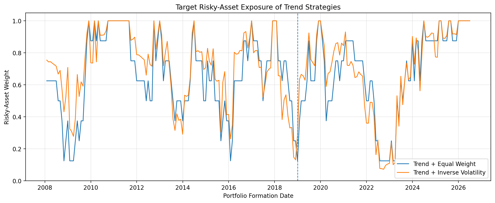
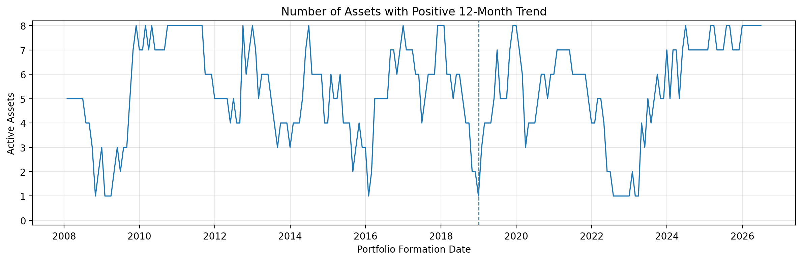

# Multi-Asset Systematic Allocation

A cost-aware systematic research project testing whether a simple medium-term trend filter improves the risk profile of a diversified multi-asset ETF portfolio, and whether inverse-volatility sizing provides additional value.

The project emphasizes research methodology rather than model complexity: real market data, pre-specified signals, portfolio construction, look-ahead control, drift-aware turnover, transaction costs, out-of-sample evaluation, and robustness testing.

---

## Research Question

**Does a simple trend signal improve a diversified multi-asset portfolio after transaction costs, and how much of the result is attributable to the trend signal versus volatility-based portfolio sizing?**

### Primary Hypothesis

Assets with positive medium-term trends may exhibit return persistence.

A simple trend filter combined with volatility-based position sizing may improve the risk-adjusted performance of a diversified multi-asset portfolio relative to static allocation.

### Null Hypothesis

Any apparent improvement may disappear out of sample or after transaction costs.

---

## Asset Universe

The Phase 0 universe consists of eight liquid ETFs representing multiple asset classes.

| Ticker | Asset Class |
|---|---|
| SPY | US Equity |
| EFA | Developed Markets ex-US Equity |
| EEM | Emerging Markets Equity |
| IEF | US Treasury Bonds |
| LQD | Investment Grade Corporate Bonds |
| GLD | Gold |
| VNQ | US Real Estate |
| DBC | Broad Commodities |

Daily adjusted market data are downloaded through `yfinance`.

The primary analysis period ends on **2026-06-30**, the final complete month before isolated missing observations identified in July 2026.

---

## Pre-Specified Research Design

The primary specification was fixed before examining strategy performance.

- Trend signal: trailing 12-month return > 0
- Volatility estimate: 63-trading-day realized volatility
- Rebalancing: monthly
- Portfolio: long-only
- Cash return: 0%
- Leverage: none
- Transaction cost: 10 bps per unit of risky-asset notional traded
- In-sample period: through 2018-12-31
- Out-of-sample period: 2019-01-01 through 2026-06-30
- Primary benchmark: monthly rebalanced Equal Weight
- Secondary benchmark: SPY Buy & Hold
- No machine learning in Phase 0
- No ex-post parameter optimization

---

## Portfolio Ablation

Four systematic portfolios are compared.

### 1. Equal Weight

Each ETF receives a 12.5% target weight.

### 2. Inverse Volatility

Weights are proportional to the inverse of each asset's 63-trading-day realized volatility and normalized to 100%.

### 3. Trend + Equal Weight

Each ETF retains its original 12.5% allocation only when its trailing 12-month return is positive.

Inactive allocations are held in cash rather than redistributed.

### 4. Trend + Inverse Volatility

The standard inverse-volatility portfolio is constructed first.

The trend filter then removes assets with non-positive 12-month trends, with removed allocations held in cash.

This ablation design separates the contribution of the **trend filter** from the contribution of **volatility-based sizing**.

---

## Backtest Methodology

### Signal Timing

All signals and volatility estimates use information available at the portfolio formation date.

Weights formed at month-end \(t\) are applied only to returns earned during month \(t+1\).

This prevents the strategy from using future information in portfolio formation.

### Drift-Aware Turnover

Turnover is not calculated by simply differencing consecutive target weights.

Existing holdings are first allowed to drift according to realized asset returns. Rebalancing turnover is then measured from these pre-rebalance weights to the new target portfolio.

### Transaction Costs

The primary model assumes:

**10 bps × risky-asset notional traded**

Sensitivity tests are also performed at 5 bps and 25 bps.

---

## Out-of-Sample Results

**OOS period: January 2019 – June 2026**

| Strategy | CAGR | Ann. Volatility | Sharpe | Max Drawdown | Calmar | Ann. Turnover |
|---|---:|---:|---:|---:|---:|---:|
| Equal Weight | 10.17% | 11.02% | 0.937 | -18.01% | 0.564 | 31.33% |
| Inverse Volatility | 7.28% | 9.19% | 0.812 | -18.71% | 0.389 | 92.90% |
| **Trend + Equal Weight** | **6.96%** | **6.88%** | **1.014** | **-9.52%** | **0.731** | **135.66%** |
| **Trend + Inverse Volatility** | **5.62%** | **5.71%** | **0.987** | **-8.22%** | **0.683** | **173.97%** |
| SPY Buy & Hold | 17.45% | 16.62% | 1.056 | -23.93% | 0.729 | — |

---

## Main Finding

The Phase 0 evidence provides **partial support** for the primary hypothesis.

The trend filter materially improves downside-risk characteristics relative to static Equal Weight allocation.

- Equal Weight OOS Sharpe: **0.937**
- Trend + Equal Weight OOS Sharpe: **1.014**
- Equal Weight OOS MDD: **-18.01%**
- Trend + Equal Weight OOS MDD: **-9.52%**

Inverse-volatility sizing alone does not improve OOS Sharpe:

- Equal Weight: **0.937**
- Inverse Volatility: **0.812**

Adding inverse-volatility sizing to the trend strategy further reduces realized volatility and maximum drawdown, but also reduces CAGR and Sharpe relative to Trend + Equal Weight.

The ablation therefore suggests that the **trend filter is the main contributor to the observed OOS improvement in downside-risk control**, while inverse-volatility sizing primarily provides additional risk reduction.

SPY Buy & Hold generates substantially higher absolute returns and a slightly higher OOS Sharpe ratio, but also materially larger volatility and drawdown.

The project therefore does **not** claim that the systematic portfolios outperform US equities on an absolute-return basis.

---

## Cumulative Wealth

The dashed vertical line marks the start of the pre-specified OOS period.



SPY dominates in absolute wealth creation, while the multi-asset strategies trade absolute return for lower portfolio risk.

---

## Drawdowns



The largest distinction between the trend-filtered portfolios and the static portfolios is visible during stressed market periods.

Trend strategies materially reduce the depth of several historical drawdowns.

---

## Dynamic Risk Exposure



The trend filter dynamically moves part of the portfolio into cash when fewer assets maintain positive 12-month trends.

This provides a mechanical explanation for much of the observed drawdown reduction.

---

## Active Trend Signals



Across the portfolio-formation sample, the average number of assets with positive 12-month trends is approximately **5.37 out of 8**, with a minimum of **1**.

The strategy therefore generally remains partially invested rather than switching completely between risk-on and cash.

---

## Robustness Checks

### Trend Lookback Sensitivity

OOS Sharpe remains broadly similar across nearby trend parameters.

| Trend Lookback | Trend + Equal Weight | Trend + Inverse Volatility |
|---:|---:|---:|
| 9 months | 1.049 | 1.020 |
| **12 months** | **1.014** | **0.987** |
| 15 months | 0.933 | 0.908 |

The pre-specified 12-month parameter is **not** the ex-post best-performing parameter.

The slightly stronger 9-month result reduces concern that the primary 12-month specification was selected because it happened to maximize historical performance.

### Transaction-Cost Sensitivity

| Cost | Equal Weight | Inverse Volatility | Trend + Equal Weight | Trend + Inverse Volatility |
|---:|---:|---:|---:|---:|
| 5 bps | 0.938 | 0.817 | 1.024 | 1.002 |
| **10 bps** | **0.937** | **0.812** | **1.014** | **0.987** |
| 25 bps | 0.933 | 0.797 | 0.985 | 0.940 |

The qualitative result survives substantially higher assumed trading costs.

---

## Bias Controls

### Look-Ahead Bias

Portfolio weights are lagged so that month-end information is used only for the following holding period.

### Data Snooping

The primary universe, 12-month trend signal, 63-day volatility estimate, monthly rebalance frequency, 10 bps cost assumption, and OOS split were fixed before performance evaluation.

Nearby parameter tests are used only for robustness analysis and do not replace the primary specification.

### IS / OOS Separation

Performance before and after 2019-01-01 is evaluated separately.

### Missing Data

Six isolated missing price observations were identified in July 2026.

Rather than imputing unobserved prices, the primary analysis ends on 2026-06-30.

### Survivorship and Universe Selection

The eight ETFs were selected retrospectively and are known to exist today.

The project therefore does not claim to fully eliminate survivorship or universe-selection bias.

---

## Limitations

- ETFs are used as accessible proxies rather than institutional futures, swaps, or total-return indices.
- The ETF universe is selected retrospectively.
- Transaction costs use a simplified constant-bps model.
- Cash earns 0% in Phase 0.
- The trend signal is inherently lagging and may respond slowly to abrupt market shocks.
- No leverage or explicit portfolio-volatility target is applied.
- Statistical significance and confidence intervals are not evaluated in Phase 0.
- Historical OOS performance is not equivalent to a live trading record.

The results should therefore be interpreted as a **systematic research exercise**, not as evidence of persistent alpha or guaranteed future profitability.

---

## Repository Structure

```text
multi-asset-systematic-allocation/
│
├── README.md
├── requirements.txt
│
├── notebooks/
│   └── 01_multi_asset_systematic_phase0.ipynb
│
├── figures/
│   ├── 01_cumulative_wealth.png
│   ├── 02_drawdowns.png
│   ├── 03_risky_asset_exposure.png
│   └── 04_active_assets.png
│
└── results/
    ├── phase0_ablation_summary.csv
    ├── phase0_oos_summary.csv
    ├── phase0_transaction_cost_sensitivity.csv
    ├── phase0_trend_lookback_sensitivity.csv
    └── phase0_turnover_summary.csv